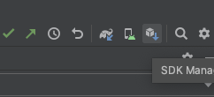

[//]: # (Приветствуем! )

[//]: # ()
[//]: # (Это плейграунд Condo Miniapps для Android, он ещё в процессе разработки, но уже позволяет пощупать реальный процесс взаимодействия с приложением.)

[//]: # ()
[//]: # (Приложение миниаппа - это всегда архив с названием www.zip который лежит в app/src/main/res/raw/www.zip, замените его собственным )

[//]: # (архивом с тем же названием чтобы тестировать собственное приложение.)

[//]: # ()
[//]: # (основные методы)

[//]: # (- авторизация)

[//]: # ()
[//]: # (    function requestServerAuthorizationByUrl&#40;miniapp_server_init_auth_url, custom_params_reserver_for_future_use, success, error&#41; )

[//]: # ()
[//]: # (    пример:)

[//]: # ()
[//]: # (            cordova.plugins.condo.requestServerAuthorizationByUrl&#40;'https://miniapp.d.doma.ai/oidc/auth', {}, function&#40;response&#41; {)

[//]: # (                console.log&#40;'recive authorication result => ', JSON.stringify&#40;response&#41;&#41;;)

[//]: # (                window.location.reload&#40;&#41;;)

[//]: # (            }, function&#40;error&#41; {)

[//]: # (                console.log&#40;error&#41;;)

[//]: # (            }&#41;;)

[//]: # ()
[//]: # (- получение текущего резидента\адреса)

[//]: # ()
[//]: # (    function getCurrentResident&#40;success, error&#41;)

[//]: # ()
[//]: # (    пример:)

[//]: # ()
[//]: # (            cordova.plugins.condo.getCurrentResident&#40;function&#40;response&#41; {)

[//]: # (                console.log&#40;"current resident\address => ", JSON.stringify&#40;response&#41;&#41;;)

[//]: # (            }, function&#40;error&#41; {)

[//]: # (                console.log&#40;error&#41;;)

[//]: # (            }&#41;;)

[//]: # ()
[//]: # (- закрытие приложения)

[//]: # ()
[//]: # (    function closeApplication&#40;success, error&#41;)

[//]: # ()
[//]: # (    пример:)

[//]: # ()
[//]: # (            cordova.plugins.condo.closeApplication&#40;function&#40;response&#41; {}, function&#40;error&#41; {}&#41;;)

# Hello!

This is a Condo Miniapps playground for Android, it is still under development, but already allows you to feel the real process of interaction with the application.

You can find the cordova app itself in the MainCordovaApplication folder, where in the www folder there is an example of interaction with the native api and you can develop something of your own.

___
# Content.
1. [Getting started](#getting_started)
2. [Common methods.](#common_methods)
3. [Testing.](#testing)

   3.1 [Testing in Demo environment](#testing-demo)

   3.2 [Testing in Production environment](#testing-production)
4. [Publishing.](#publishing)

---
# Getting started. 

1. Installing the necessary dependencies:

- make sure you have the latest version of Android Studio [installed](https://developer.android.com/studio/install)

- for Windows systems, [install](https://learn.microsoft.com/en-us/windows/wsl/install) wsl subsystem, you need it to use linux commands from cmd like "wsl <linux_command>"

- [install](https://github.com/nvm-sh/nvm#installing-and-updating) nvm, node and npm 

- cordova installation:

        npm install -g cordova
- open Android Studio, choose project folder to open, then open sdk manager
  

- project is running under android 12 (api level 32), install required dependenies
  
  

2. Editing the application

- open the project directory and go to the /MainCordovaApplication/www subdirectory

  it will contain your application code, edit it freely

3. Launching and testing the application

- open project folder with Android Studio, wait until indexing is complete, then choose real or virtual device and click "run app"
  

- "updateCordovaProjectToDemo" subtask runs during project build (file app/build.gradle, 66 line), this subtask automatically builds final cordova app file 'www.zip' (MainCordovaApplication/platforms/ios/www.zip) and copies it into app/src/main/res/raw/www.zip to use it by android app

 ---
# Common methods. 
- authorization

  function requestServerAuthorizationByUrl(miniapp_server_init_auth_url, custom_params_reserver_for_future_use, success, error)

  example:

            cordova.plugins.condo.requestServerAuthorizationByUrl('https://miniapp.d.doma.ai/oidc/auth', {}, function(response) {
                console.log('recive authorication result => ', JSON.stringify(response));
                window.location.reload();
            }, function(error) {
                console.log(error);
            });

- obtaining a current resident/address

  function getCurrentResident(success, error)

  example:

            cordova.plugins.condo.getCurrentResident(function(response) {
                console.log("current resident\address => ", JSON.stringify(response));
            }, function(error) {
                console.log(error);
            });

- application closing

  function closeApplication(success, error)

  example:

            cordova.plugins.condo.closeApplication(function(response) {}, function(error) {});

[//]: # (---)

[//]: # (# Testing&#40;as of November 1, 2022&#41;.  )

[//]: # (## Demo environment  )

[//]: # (1. Open safari on the device running the simulator with your application inside the CordovaDemoApp)

[//]: # (2. Open safari settings)

[//]: # ()
[//]: # (   ![Settings]&#40;./ReadmeImages/Testing/Demo/2.png&#41;)

[//]: # (3. Open the Advanced tab and activate the "Show Develop menu in menu bar" setting)

[//]: # (   ![ShowDeveloperMenu]&#40;./ReadmeImages/Testing/Demo/3.png&#41;)

[//]: # (4. Open the Develop menu in Safari, find your simulator and select your mini-application there.)

[//]: # (   ![OpenDeveloperMenu]&#40;./ReadmeImages/Testing/Demo/4.png&#41;)

[//]: # (5. The standard Safari debugging tools connected to your mini-application will open)

[//]: # (   ![DebuggingToolsShowed]&#40;./ReadmeImages/Testing/Demo/5.png&#41;)

[//]: # ()
[//]: # (## Production environment  )

[//]: # (1.  Open the project directory and navigate to the subdirectory)

[//]: # ()
[//]: # (        /MainCordovaApplication/platforms/ios/)

[//]: # (    In it you will find the www directory.)

[//]: # (    Create a zip archive from the www directory by right-clicking on the folder and selecting Compress "www".)

[//]: # ()
[//]: # (2. Place the resulting archive in the iCloud storage of the account connected to the device on which you will be testing the application.)

[//]: # ()
[//]: # (3. Install the Doma app from the AppStore and log in to it)

[//]: # (   https://apps.apple.com/us/app/doma/id1573897686)

[//]: # ()
[//]: # (4. The app you downloaded has built-in functionality for debugging mini-applications. To turn it on and off, you use links to open it on your device:)

[//]: # ()
[//]: # (- Switching on:)

[//]: # ()
[//]: # (  ai.doma.client.service://miniapps/local/enable)

[//]: # (- Switching off:)

[//]: # ()
[//]: # (  ai.doma.client.service://miniapps/local/disable)

[//]: # ()
[//]: # (5. Now, on the main application screen in the list of mini-applications, the last button allows you to download or replace a previously downloaded mini-application from files. When you click on it, you need to select the previously downloaded archive in iCloud.)

[//]: # ()
[//]: # (6. The application loaded in this way has a built-in js console, which is accessible by clicking on the button at the bottom right of the open mini-application and is able to show a lot of additional information, including various errors.)

---
# Publishing 
To publish the mini-application, send the 'www.zip' archive you received during the testing phase to the people at Doma with whom you interact.   
        