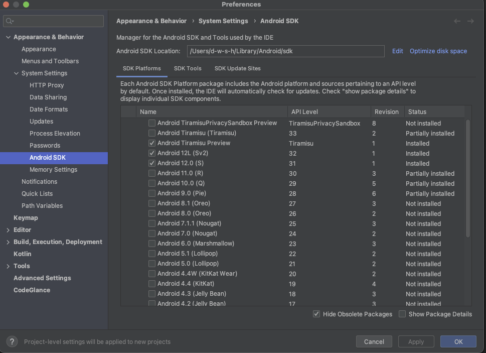
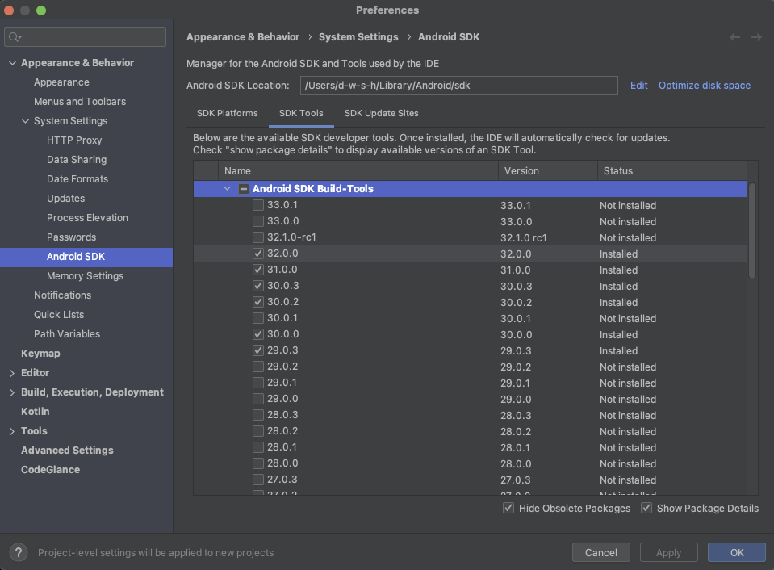
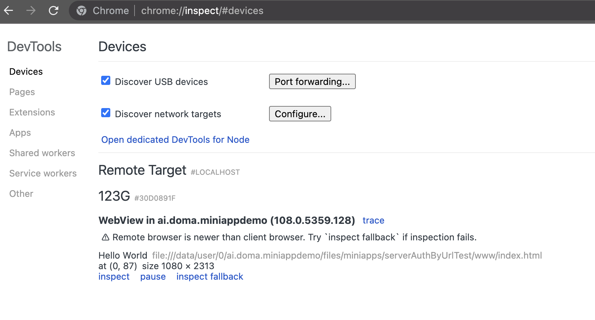

# Hello

This is a Condo Miniapps playground for Android, it is still under development, but already allows you to feel the real process of interaction with the application.

You can find the cordova app itself in the `MainCordovaApplication` folder, where in the www folder there is an example of interaction with the native api and you can develop something of your own.


# Content
1. [Getting started](#getting_started)
2. [Common methods.](#common_methods)
3. [Important differences.](#important_differences)
4. [Navigation system.](#navigation_system)
5. [Working with user input.](#working_with_user_input)
6. [Environment.](#environment)
7. [Testing.](#testing)

   6.1 [Testing in Demo environment](#testing-demo)
   
   6.2 [Testing in Production environment](#testing-production)
8. [Publishing.](#publishing)


# Getting started <a name="getting_started"></a>

1. Installing the necessary dependencies:

- make sure you have the latest version of Android Studio [installed](https://developer.android.com/studio/install)

- install node and npm
    - method 1:
        - [install](https://github.com/nvm-sh/nvm#installing-and-updating) nvm
        - and next launch in terminal:

              nvm install node
    - method 2 (for windows):
      just [install node](https://nodejs.org/en/download)

- cordova installation:

        npm install -g cordova
- open Android Studio, choose project folder to open, then open sdk manager


- project is running under android 12 (api level 32), install required dependenies





2. Editing the application

- open the project directory and go to the `/MainCordovaApplication/www` subdirectory

  it will contain your application code, edit it freely

3. Launching and testing the application
- ⚠️Android app works with miniapps builds for the iOS environment from `MainCordovaApplication/platforms/ios`.

- For linux and macOS: there is `updateCordovaProjectToDemo` subtask which runs during project build (file `app/build.gradle`, 66 line), this subtask automatically builds final cordova app file `www.zip` (`MainCordovaApplication/platforms/ios/www.zip`) and copies it into `app/src/main/res/raw/www.zip` to use it by android app.
- For Windows: before each app build run these scripts:

        cd MainCordovaApplication
        cordova prepare ios
        tar -a -c -f www.zip www
        copy /y  www.zip ..\app\src\main\res\raw\www.zip

- open project folder with Android Studio, wait until indexing is complete, then choose real or virtual device and click play button


- if you have this error


accept license agreements by:

        cd ~/Library/Android/sdk/tools/bin/
        ./sdkmanager --licenses


# Common methods <a name="common_methods"></a>
- authorization


`function requestServerAuthorizationByUrl(miniapp_server_init_auth_url, custom_params_reserver_for_future_use, success, error)`

example:

```javascript  
        cordova.plugins.condo.requestServerAuthorizationByUrl('https://miniapp.d.doma.ai/oidc/auth', {}, function(response) {
            console.log('recive authorication result => ', JSON.stringify(response));
            window.location.reload();
        }, function(error) {
            console.log(error);
        });
```

- obtaining a current resident/address

`function getCurrentResident(success, error)`

example:
```javascript  
        cordova.plugins.condo.getCurrentResident(function(response) {
            console.log("current resident\address => ", JSON.stringify(response));
        }, function(error) {
            console.log(error);
        });
```


- application closing

`function closeApplication(success, error)`

example:
```javascript  
        cordova.plugins.condo.closeApplication(function(response) {}, function(error) {});
```


# Navigation system. <a name="navigation_system"></a>

We provide native navigation for your minapps with js code side control. Each miniapp launches with a system navigation bar and a close button on it. In general, you can implement everything else on your side, make an additional panel or controls for nested navigation and work with them.

But we **strongly recommend** to do otherwise. You can control what the system navigation bar shows on your side. This is achieved by using the following methods on history object inside condo plugin:

- Add a new item to the navigation stack:

    `function pushState(state, title)`

    example:

    ```
    cordova.plugins.condo.history.pushState({"StateKey": "StateValue"}, "Title for navigation bar");
    ```

- Replace the current item in the navigation stack:

    `function replaceState(state, title)`

    example:

    ```
    cordova.plugins.condo.history.replaceState({"StateKey": "StateValue"}, "Title for navigation bar");
    ```

- Take a step back:

    `function back()`

    example:

    ```
    cordova.plugins.condo.history.back();
    ```

- Take a few steps back:

    `function go(amount)`

    example:

    ```
    cordova.plugins.condo.history.go(-1);
    ```

    Note that unlike the system history object, the parameter passed here is always negative and can only lead backwards. We have no possibility to go forward to the place we came back from.

**Note**: you can make the titles on your side big and beautiful and always pass the title blank to the methods above.

In addition, you need to recognize when a user has pressed the system back button. This is achieved by subscribing to the already existing Cordova backbutton event https://cordova.apache.org/docs/en/12.x/cordova/events/events.html#backbutton This event is called for the system button as well.

```
document.addEventListener("backbutton", onBackKeyDown, false);

function onBackKeyDown() {
    // Handle the back button
}
```

And of course after all these changes you can get the State that is now showing on the navigation bar. This is done similarly to the standard system method - by subscribing to the condoPopstate event:
```
addEventListener("condoPopstate", (event) => {console.log("condoPopstate => ", JSON.stringify(event.state));});
```


# Working with user input. <a name="working_with_user_input"></a>

## Sharing files. <a name="sharing_files"></a>

Original Documentation: [**WEB File API**](https://developer.mozilla.org/en-US/docs/Web/API/Navigator/share)
### Example for sharing local document:
```html
    <script>
       function shareSomeDocument() {
           fetch('images.com/some_image.png')
              .then(function(response) {
                   return response.blob()
               })
               .then(function(blob) {
                  var file = new File([blob], "image.png", {type: blob.type});
                  var filesArray = [file];
                     navigator.share({
                     files: filesArray
                  });
               });
           }
    </script>
```

> [!CAUTION]
> On iOS calls to `navigator.share` with `files` argument **must** be called in responce to user interaction (button tap, or alike).
> Otherwise it throws an error

## 3.2 Importing Files. <a name="import_files"></a>
Original Documentation: [**Using files from web applications**](https://developer.mozilla.org/en-US/docs/Web/API/File_API/Using_files_from_web_applications)
### Importing images:
Button opens camera:
```html
<input type="file" accept="image/*" capture>
```
Button opens image picker (select one image):
```html
<input type="file" accept="image/*">
```
Button opens image picker (select multiple images):
```html
<input type="file" accept="image/*" multiple>
```

# Environment. <a name="environment"></a>

The plugin provides a **hostApplication** object that can synchronously output information about the current environment in which the mini-app is running.

- Find out whether the application is looking at the production server or not:

    `function isDemoEnvironment()`

    example:

    ```
    console.log(cordova.plugins.condo.hostApplication.isDemoEnvironment());
    ```

- The base address of the current server:

    `function baseURL()`

    example:

    ```
    console.log(cordova.plugins.condo.hostApplication.baseURL());
    ```

- Main application installation ID:

    `function installationID()`

    example:

    ```
    console.log(cordova.plugins.condo.hostApplication.installationID());
    ```

- Device ID:

    `function deviceID()`

    example:

    ```
    console.log(cordova.plugins.condo.hostApplication.deviceID());
    ```

- Application locale:

    `function locale()`

    example:

    ```
    console.log(cordova.plugins.condo.hostApplication.locale());
    ```


# Important differences. <a name="important_differences"></a>
Unlike the standard Cordova, our application uses an additional configuration file, which must be located in the www directory and named **native_config.json**

This file is a json file and may contain the following fields:

1. presentationStyle - application display type, required, should be set to **present_fullscreen**
2. mobile_permissions - An array of strings describing the necessary permissions for the application to work. the array can contain the following values: **record_audio**, **camera**, **audio_settings**


# Testing  <a name="testing"></a>

## Demo environment  <a name="testing-demo"></a>

1. Open Chrome and enter into url field `chrome://inspect/#devices`
   Choose WebView in ai.doma.miniappdemo and click "inspect"

   

2. Yay! Standard Chrome debugging tools are connected to your mini-application

   

## Production environment  <a name="testing-production"></a>

1. Take `www.zip` archive built for ios environment:

        MainCordovaApplication/platforms/ios/www.zip

   If it doesn't exist create it from folder:

        /MainCordovaApplication/platforms/ios/www

2. [Install](https://play.google.com/store/apps/details?id=ai.doma.client) Doma app from Google Play

3. The app you downloaded has built-in functionality for debugging mini-applications. To turn it on & off, you can use these deeplinks from your phone:

- [Click here to switch on](https://mobile.doma.ai/api/mobile/partners/miniapps/enable-local.html)
- [Click here to switch off](https://mobile.doma.ai/api/mobile/partners/miniapps/disable-local.html)

5. Now, on the main application screen in the list of mini-applications, the last button allows you to download or replace a previously downloaded mini-application from files. When you click on it, you need to select the previously taken `www.zip` archive.

6. The application loaded in this way has a built-in js console, which is accessible by clicking on the button at the bottom right of the open mini-application and is able to show a lot of additional information, including various errors.


# Publishing <a name="publishing"></a>
To publish the mini-application, send the `www.zip` archive you received during the testing phase to the people at Doma with whom you interact.   
        
